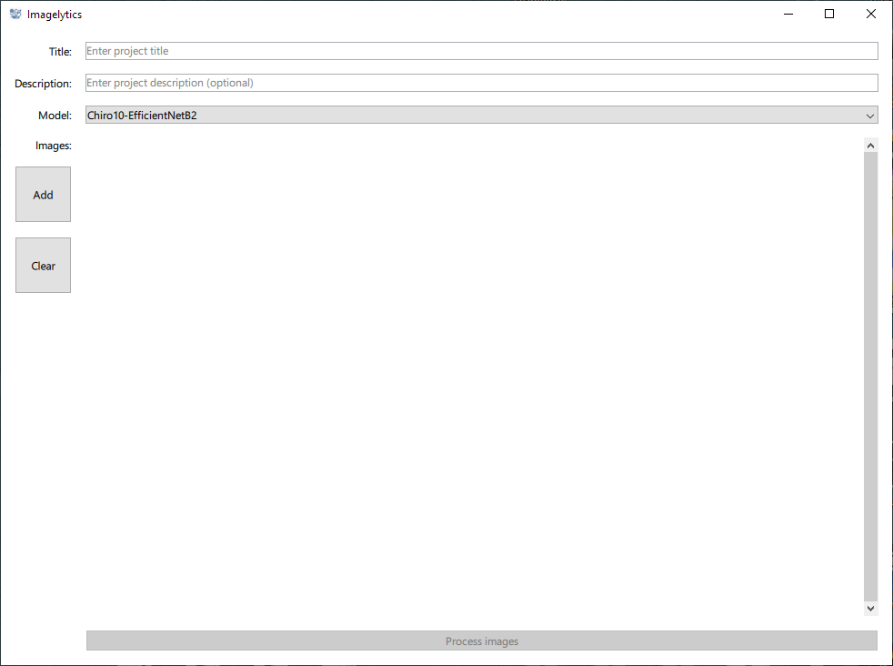
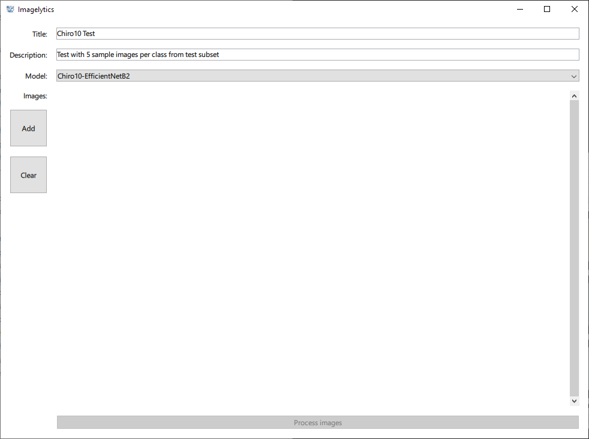
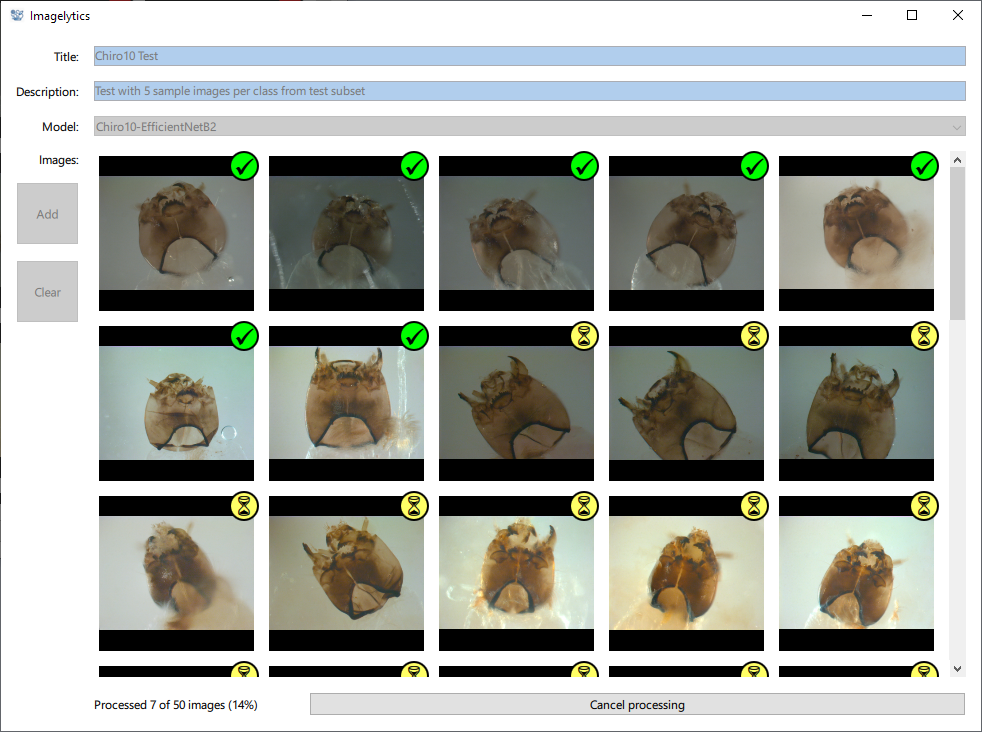
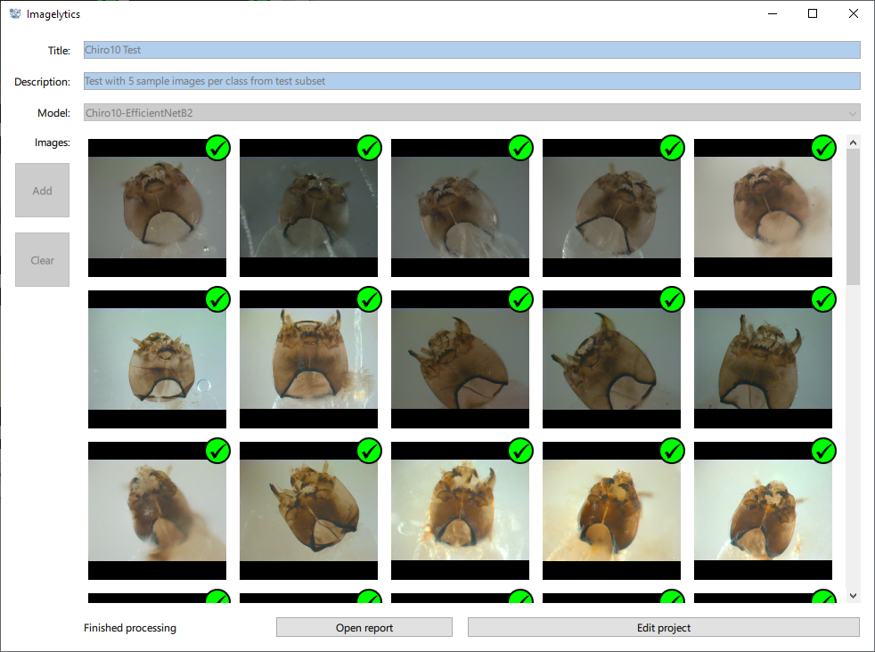
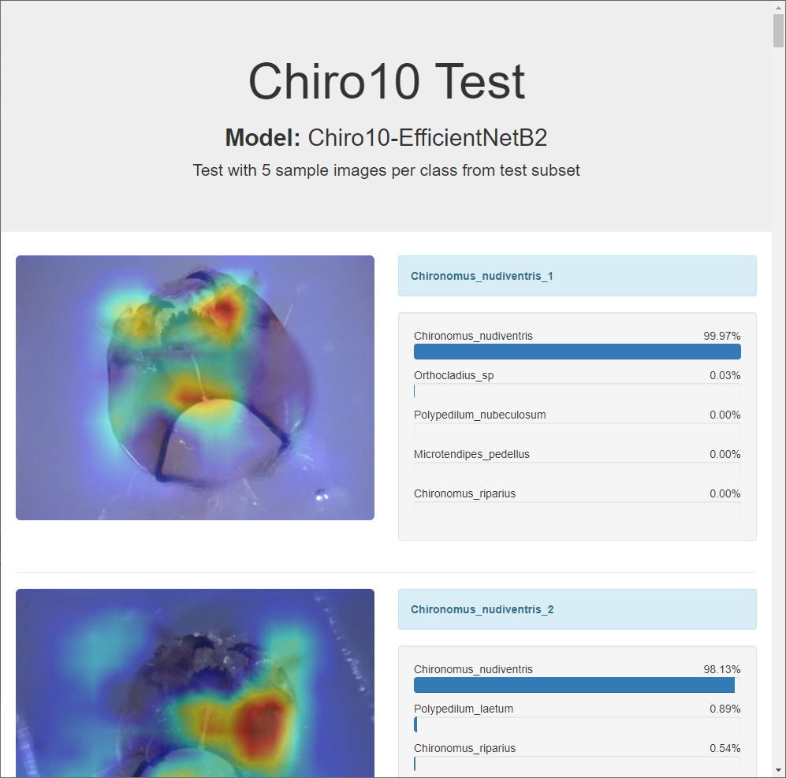

# Imagelytics: A standalone desktop application for image classification with visualization and reporting

## Repository structure
The repository consists of three folders:
1) The <code>[app](app)</code> folder contains the source code for the Imagelytic application. It is an independent project that should have it separate virtual environment. For more details please check <code>[app/README.md](app/README.md)</code>.
2) The <code>[train](train)</code> folder contains scripts that can be used to train and prepare metadata for a new model that can be used with the application. It is also an independent project that should have it separate virtual environment. For more details please check <code>[train/README.md](train/README.md)</code>.
3) The <code>[docs](docs)</code> folder contains additional files: 
   - <code>[docs/chiro10-sample-images](docs/chiro10-sample-images)</code> - sample images that can be used to test the application using the built-in Chiro10-EfficientNetB2 model.
   - <code>[docs/chiro10-sample-report.html](docs/chiro10-sample-report.html)</code> - sample report created with the application and appropriate Chiro10 sample images.
   - <code>[docs/images](docs/images)</code> - images of the UI for this document.

## Download and install Imagelytics
Imagelytics installation package for Windows is available for download in the repository release section: 
https://github.com/a-milosavljevic/imagelytics/releases

## Processing images with Imagelytics
1) Open the application, enter the <code>Title</code> and optionally the <code>Description</code> of the project, and select the <code>Model</code> you want to use.

2) Add images by dragging and dropping them into the central area labeled as <code>Images</code>. Alternatively, you may add them using the <code>Add</code> button. 

3) To begin processing please click the <code>Process images</code> button. 
4) After you select the location where the report will be saved, the processing will begin.
5) The processing is done in the background and it can take a significant amount of time. To track the progress number and percentage of processed images are shown. You may also request to cancel the process by clicking the <code>Cancel processing</code> button.

6) Once the process finishes you may open the report by clicking the <code>Open report</code> button. The <code>Edit project</code> button will bring back the edit mode.

